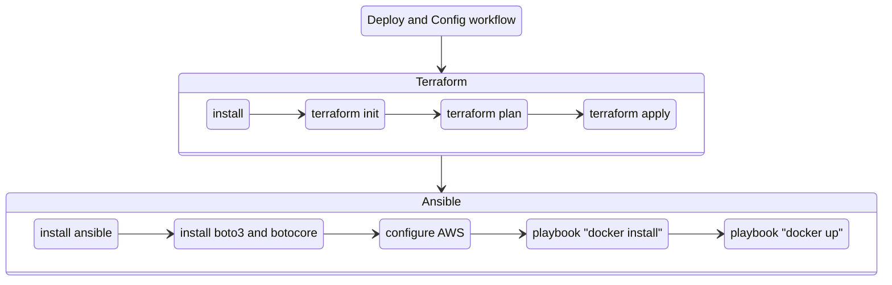

# osticket stack

A fully automated deployment pipeline for osTicket on AWS EC2 using Terraform, Ansible, Docker, and GitHub Actions.
Designed for learning infrastructure-as-code and cloud provisioning best practices with DNS and HTTPS via Cloudflare and Certbot.

## :trophy: Features

- Provision osTicket in AWS EC2 with HTTPS
- Fully automated with Terraform, Ansible, Docker and GitHub Actions
- Uses Cloudflare for DNS and Certbot for TLS

## :briefcase: Requirements

- **An AWS free tier account** for hosting
- **A HCP Terraform account** for storing a state file
- **A Cloudflare account** for managing DNS records

## :zap: Quickstart

1. Fork and clone this repo
2. Set up Terraform Cloud workspace
3. Add secrets in GitHub
4. Trigger the deployment workflow

## :rocket: Step-by-step

### 1. Create an AWS IAM user

Go to your AWS account and create a user with **AmazonEC2FullAccess** permission. 
Then create an access key and copy your **AWS_ACCESS_KEY_ID** and **AWS_SECRET_ACCESS_KEY**.

For more details about managing access keys, see [the best practices for managing AWS access keys](https://docs.aws.amazon.com/IAM/latest/UserGuide/id_credentials_access-keys.html#securing_access-keys).

### 2. Setup remote backend for Terraform

In your HCP account:
1. Create an organization
2. Create a workspace and set variables:
   - **AWS_REGION**
   - **AWS_ACCESS_KEY_ID** (sensitive)
   - **AWS_SECRET_ACCESS_KEY** (sensitive)
4. Create API token

Refer to the [Terraform Cloud documentation](https://developer.hashicorp.com/terraform/cloud-docs) for more details.

### 3. Setup your repository

Fork this repository. 
 
Create new environment called **_production_** (Settings - Environments - New environment). 
Add the following secrets and variables into your created environment.

| Name                   | Type       | Description                       |
| ---------------------- | ---------- | --------------------------------- |
| AWS_REGION             |  variable  | AWS region for creating resources |
| AWS_ACCESS_KEY_ID      |  secret    | AWS access key ID                 |
| AWS_SECRET_ACCESS_KEY  |  secret    | AWS secret access key             |
| TF_API_TOKEN           |  secret    | Terraform user API token          |
| TF_CLOUD_ORGANIZATION  |  variable  | Terraform Cloud organization      |
| TF_WORKSPACE           |  variable  | Terraform Cloud workspace         |
| CLOUDFLARE_API_TOKEN   |  secret    | Cloudflare API token              |
| CLOUDFLARE_ZONE_ID     |  secret    | Cloudflare Zone ID                |
| EC2_PRIVATE_KEY        |  secret    | Private key of a SSH key pair     |
| EC2_PUBLIC_KEY         |  secret    | Public key of a SSH key pair      |
| DOMAIN_NAME            |  variable  | Your domain name                  |
| EMAIL                  |  variable  | Your email address                |

### 3. Deploy and configure

Go to the **Actions** tab and manually run the **1. Deploy and configure** workflow.

## :checkered_flag: Clean up

After you finish don't forget to clean your resources up. 
Run **2. Clean up resources** workflow for that matter.

## :gear: Workflow explained

### Deploy and Config

## :package: Components Used

- **Terraform** – for infrastructure provisioning
- **Ansible** – for configuration management
- **Docker** – to run osTicket
- **GitHub Actions** – to automate deployment
- **Cloudflare** – for DNS and HTTPS via Certbot
